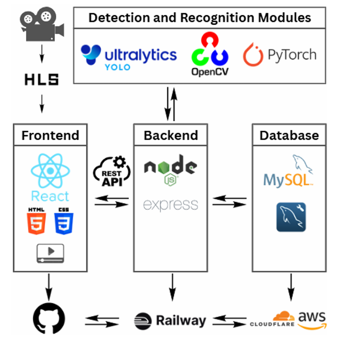
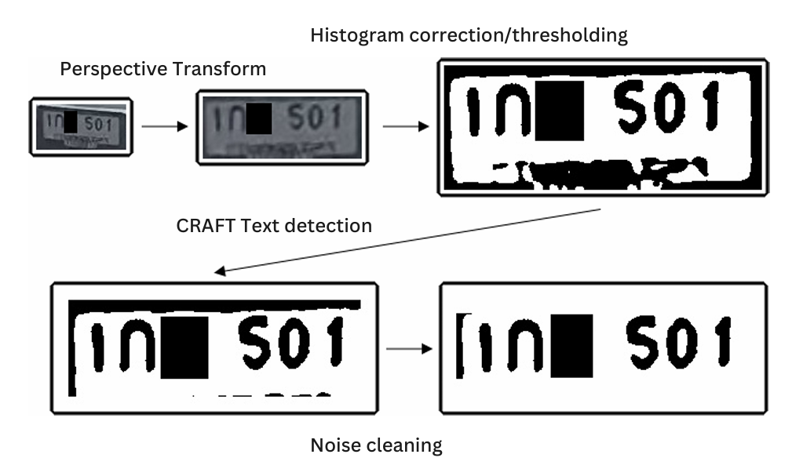
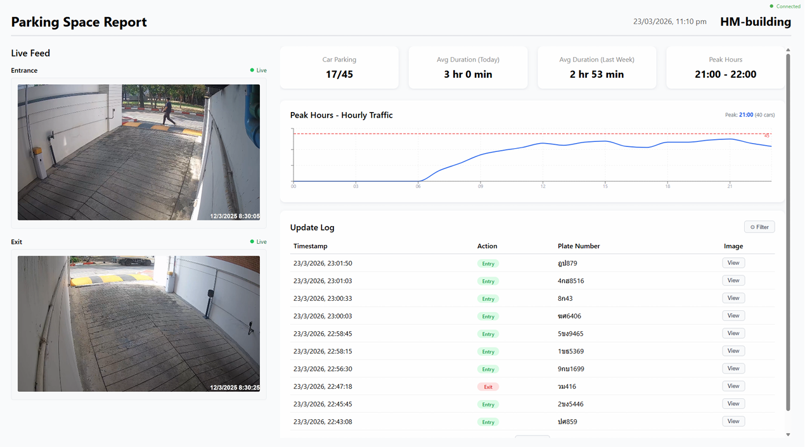

# 🚗 Parking-Space-Availability-with-Low-Resolution-License-Plate

A cost-effective smart parking system that uses existing CCTV cameras to detect vehicle entry/exit and estimate real-time parking availability using AI.

## 📌 Overview

This project solves a real-world problem: **finding parking space efficiently**.

Instead of installing expensive sensors or ALPR cameras, this system leverages:
- Existing CCTV infrastructure
- Edge AI processing
- Cloud-based monitoring dashboard

## 🎯 Key Features

- 🚘 Real-time vehicle detection using YOLO
- 🔍 License plate detection & OCR pipeline
- 📊 Live parking availability dashboard
- 📡 RTSP → HLS live video streaming
- ☁️ Cloud-based backend & database
- ⚡ Edge computing with Raspberry Pi + Coral TPU

## 🏗️ System Architecture

### Pipeline:
1. CCTV Camera (RTSP stream)
2. Edge Device (Raspberry Pi + Coral TPU)
3. Vehicle Detection (YOLO)
4. License Plate Recognition (OCR + CNN)
5. Backend API (Node.js)
6. Database (MySQL)
7. Web Dashboard (React)

## 🧠 AI Models Used

- YOLO (Vehicle Detection)
- YOLO / Custom Model (Plate Detection)
- CNN (Character Recognition)
- CRAFT (Text Detection)
- SORT (Tracking)

## ⚙️ Tech Stack

| Layer        | Technology |
|-------------|------------|
| Edge AI     | Python, OpenCV, YOLO, ONNX |
| Backend     | Node.js, Express |
| Frontend    | React |
| Database    | MySQL |
| Streaming   | FFmpeg, HLS |
| Cloud       | AWS, Cloudflare R2 |

## Sample Dataset

- These are images from the camera before pre-processing steps, the cropped license plate resolution are between 80*50 - 110*80 px which can be considered mind blowing small and hard to verify due to oblique angle. Also, for Thai-language character, there are multiple letter that quite impossible to separate from each other for example ณ ญ ฒ , ก ภ , ห ท according to the image resolution.

- one of the pre-processing step that we use to remove the noise and rescue the character is shown in the image below

## 📸 Demo

### Dashboard

### Alphabet Recognition Output

## 🚀 How It Works

- Detect vehicles from CCTV feed
- Track using SORT algorithm
- Trigger event when crossing line
- Extract license plate
- Run OCR pipeline
- Store entry/exit data
- Compute parking availability

## 📈 Results

- Real-time processing on edge device
- Optimized for low-resolution CCTV
- 94.8% on character accuracy on Thai license plates (white plates)

## ⚠️ Limitations

- Performance depends on camera angle & lighting
- Limited dataset (real-world constraint)
- Network dependency for cloud sync

## 🔮 Future Improvements

- Multi-camera fusion
- Mobile app integration
- Better OCR for all plate types
- Edge-only deployment (offline mode)

## 👨‍💻 Authors

- Pavares Tomaneenilrat + mixer and gun
- Team Members (KMITL Robotics & AI Engineering)

